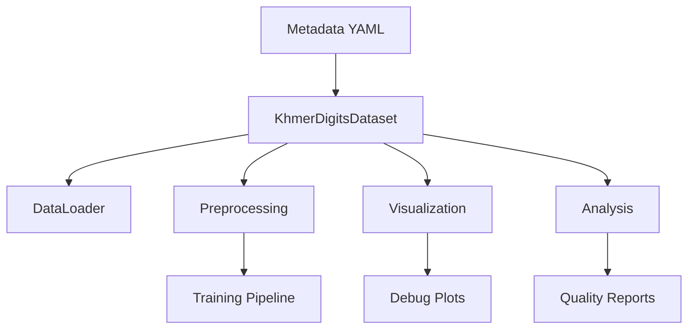

# Data Pipeline and Utilities Documentation

## Table of Contents
1. [Overview](#overview)
2. [Module Architecture](#module-architecture)
3. [Dataset Component](#dataset-component)
4. [Preprocessing Component](#preprocessing-component)
5. [Visualization Component](#visualization-component)
6. [Analysis Component](#analysis-component)
7. [Quick Start Guide](#quick-start-guide)
8. [Configuration Options](#configuration-options)
9. [Integration with Training Pipeline](#integration-with-training-pipeline)
10. [Troubleshooting](#troubleshooting)
11. [Performance Optimization](#performance-optimization)
12. [API Reference](#api-reference)

---

## Overview

The `data_utils` module provides a complete data pipeline infrastructure for the Khmer digits OCR project, handling data loading, preprocessing, visualization, and analysis.

### Quick Start
```python
from src.modules.data_utils import (
    KhmerDigitsDataset, create_data_loaders,
    get_train_transforms, get_val_transforms,
    plot_samples, DatasetAnalyzer
)

# Load dataset
dataset = KhmerDigitsDataset('generated_data/metadata.yaml', split='train')

# Create data loaders
train_transform = get_train_transforms(image_size=(128, 64))
val_transform = get_val_transforms(image_size=(128, 64))

train_loader, val_loader = create_data_loaders(
    'generated_data/metadata.yaml',
    train_transform=train_transform,
    val_transform=val_transform,
    batch_size=32
)

# Visualize and analyze
plot_samples(dataset, num_samples=16, save_path='samples.png')
analyzer = DatasetAnalyzer(dataset)
report = analyzer.generate_comprehensive_report('analysis.json')
```

## Module Architecture

```
src/modules/data_utils/
├── __init__.py          # Module exports
├── dataset.py           # PyTorch Dataset and DataLoader utilities
├── preprocessing.py     # Image transforms and augmentation
├── visualization.py     # Data visualization tools
├── analysis.py          # Dataset analysis and validation
└── font_utils.py        # Khmer font detection and rendering utilities
```

### Component Relationships


---

## Dataset Component

### KhmerDigitsDataset Class

Main dataset class for loading synthetic Khmer digit data.

```python
# Basic usage
dataset = KhmerDigitsDataset(
    metadata_path='generated_data/metadata.yaml',
    split='train',  # 'train', 'val', 'all'
    transform=None,
    max_sequence_length=8
)

# Character encoding (automatic)
# ០→0, ១→1, ២→2, ៣→3, ៤→4, ៥→5, ៦→6, ៧→7, ៨→8, ៩→9
# <EOS>→10, <PAD>→11, <BLANK>→12

# Access samples
image, label_tensor, metadata = dataset[0]
print(f"Label: {metadata['original_label']}")
print(f"Encoded: {label_tensor.tolist()}")

# Dataset statistics
stats = dataset.get_dataset_stats()
char_to_idx, idx_to_char = dataset.get_character_mappings()
```

### DataLoader Creation

```python
# Standard approach
train_loader, val_loader = create_data_loaders(
    metadata_path='generated_data/metadata.yaml',
    train_transform=train_transform,
    val_transform=val_transform,
    batch_size=32,
    num_workers=4,
    shuffle_train=True
)

# Custom split ratio
train_loader, val_loader = create_combined_data_loader(
    metadata_path='generated_data/metadata.yaml',
    train_ratio=0.9,
    batch_size=32
)

# Batch processing
for images, labels, metadata_list in train_loader:
    # images: [batch_size, 3, height, width]
    # labels: [batch_size, max_seq_length + 1]
    # metadata_list: List of dictionaries
    pass
```

## Preprocessing Component

### Image Transforms

```python
# Training transforms (with augmentation)
train_transform = get_train_transforms(
    image_size=(128, 64),
    augmentation_strength=0.3,  # 0.0 to 1.0
    normalize=True
)

# Validation transforms (no augmentation)
val_transform = get_val_transforms(
    image_size=(128, 64),
    normalize=True
)

# Custom preprocessor
from src.modules.data_utils.preprocessing import ImagePreprocessor

preprocessor = ImagePreprocessor(
    image_size=(128, 64),
    normalize=True,
    mean=(0.485, 0.456, 0.406),
    std=(0.229, 0.224, 0.225)
)

# Different transform types
base_transform = preprocessor.get_base_transforms()
train_transform = preprocessor.get_train_transforms(augmentation_strength=0.5)
```

### Available Augmentations

- **Color Jitter**: Brightness, contrast, saturation adjustments
- **Rotation**: ±3° rotation with white fill
- **Perspective**: Slight 3D distortion effect
- **Gaussian Noise**: Configurable noise addition
- **Random Blur**: Optional blur effects

### Test-Time Augmentation

```python
from src.modules.data_utils.preprocessing import TestTimeAugmentation

tta = TestTimeAugmentation(base_transform, num_augmentations=5)
augmented_tensors = tta(image)  # Returns list of tensors
```

## Visualization Component

### Basic Plotting

```python
# Plot dataset samples
plot_samples(dataset, num_samples=16, cols=4, save_path='samples.png')

# Plot dataset statistics
plot_dataset_stats(dataset, save_path='stats.png')

# Advanced visualizer
from src.modules.data_utils import DataVisualizer

visualizer = DataVisualizer(figsize=(12, 8))

# Batch visualization
fig = visualizer.plot_batch_samples(train_loader, num_batches=2)

# Comprehensive statistics
fig = visualizer.plot_dataset_statistics(dataset)

# Transform comparison
transforms_list = [
    ('Original', lambda x: x),
    ('Training', train_transform),
    ('Validation', val_transform)
]
fig = visualizer.plot_transforms_comparison(dataset, 0, transforms_list)
```

### Training Progress

```python
from src.modules.data_utils.visualization import plot_training_progress

# Plot training curves
fig = plot_training_progress(
    train_losses=[2.5, 1.8, 1.2, 0.9],
    val_losses=[2.7, 2.0, 1.4, 1.1],
    train_accuracies=[10, 35, 60, 75],
    val_accuracies=[8, 30, 55, 70],
    save_path='training_progress.png'
)
```

## Analysis Component

### Dataset Quality Analysis

```python
from src.modules.data_utils import DatasetAnalyzer, calculate_dataset_metrics

# Create analyzer
analyzer = DatasetAnalyzer(dataset)

# Basic metrics
metrics = calculate_dataset_metrics(dataset)
print(f"Diversity score: {metrics['diversity_score']:.3f}")
print(f"Font balance: {metrics['font_balance_score']:.3f}")
print(f"Character coverage: {metrics['character_coverage']:.3f}")

# Detailed analysis
seq_analysis = analyzer.analyze_sequence_patterns()
visual_analysis = analyzer.analyze_visual_properties()
aug_analysis = analyzer.analyze_augmentation_impact()

# Quality validation
quality = analyzer.validate_data_quality()
print(f"Dataset valid: {quality['is_valid']}")
print(f"Issues: {quality['issues']}")

# Comprehensive report
report = analyzer.generate_comprehensive_report('analysis_report.json')
plots = analyzer.create_analysis_plots(save_dir='analysis_plots')
```

### Validation Functions

```python
from src.modules.data_utils import validate_dataset_quality

# Quality validation with thresholds
is_valid, issues = validate_dataset_quality(
    dataset,
    min_samples=1000,
    min_diversity=0.7,
    min_font_balance=0.2
)

print(f"Dataset quality: {'PASS' if is_valid else 'FAIL'}")
if issues:
    for issue in issues:
        print(f"  - {issue}")
```

## Font Utilities Component

### Khmer Font Management

The font utilities provide automatic Khmer font detection and safe text rendering for matplotlib visualizations.

#### Basic Font Setup

```python
from src.modules.data_utils import print_font_status, setup_khmer_fonts

# Check font detection status
print_font_status()

# Get selected font name
selected_font = setup_khmer_fonts()
print(f"Using font: {selected_font}")
```

#### Safe Text Rendering

```python
from src.modules.data_utils import safe_khmer_text

# Automatic font handling with fallback
khmer_text = "០១២៣៤៥"
display_text, font_props = safe_khmer_text(
    khmer_text,
    fallback_format="Sample {}",
    index=0
)

print(f"Original: {khmer_text}")
print(f"Display: {display_text}")
print(f"Font properties: {font_props}")
```

#### Advanced Font Management

```python
from src.modules.data_utils import KhmerFontManager

# Create font manager
manager = KhmerFontManager()

# Check available fonts
print(f"Available fonts: {len(manager.available_fonts)}")
for font_name, font_path in manager.available_fonts.items():
    print(f"  {font_name}: {font_path}")

# Get font properties for matplotlib
font_props = manager.get_font_properties()
print(f"Font properties: {font_props}")

# Test safe text rendering
test_text = "៦៧៨៩០"
safe_text, props = manager.render_safe_text(test_text, "Fallback {}", 1)
print(f"Rendered: {safe_text} with {props}")
```

### Font Detection Features

The font manager automatically detects Khmer fonts from multiple sources:

1. **Project Fonts**: TTF files in `src/fonts/` directory
2. **System Fonts**: Platform-specific Khmer fonts
3. **Cross-Platform**: Windows, macOS, and Linux support

#### Font Priority

```python
# Font selection priority (highest to lowest)
priority_fonts = [
    'Khmer OS',           # Preferred for digit rendering
    'Khmer OS System',    # System variant
    'Khmer UI',           # Windows default
    'Khmer Sangam MN',    # macOS font
    'Other detected fonts'
]
```

### Visualization Integration

All visualization functions automatically use proper Khmer fonts:

```python
# These now handle Khmer text properly
plot_samples(dataset, save_path='samples.png')        # ✅ Proper Khmer labels
plot_dataset_stats(dataset, save_path='stats.png')     # ✅ Correct character frequency
visualizer.plot_batch_samples(dataloader)              # ✅ Font-aware rendering
```

### Troubleshooting Font Issues

#### Check Font Status
```python
from src.modules.data_utils import print_font_status

print_font_status()
# Output shows:
# - Number of detected fonts
# - Selected font name
# - Font paths (project vs system)
# - Recommendations for issues
```

#### Manual Font Testing
```python
manager = KhmerFontManager()

# Test specific font
if manager._test_khmer_rendering('Khmer OS'):
    print("✅ Khmer OS works")
else:
    print("❌ Font not working")

# Get detailed font info
manager.print_font_info()
```

#### Common Issues and Solutions

**No Fonts Detected:**
```python
# Solution 1: Install system Khmer fonts
# Windows: Install Khmer UI, Khmer OS
# macOS: Install Khmer Sangam MN
# Linux: Install khmer-fonts package

# Solution 2: Verify project fonts
# Check that TTF files in src/fonts/ are valid
# Ensure fonts contain Khmer Unicode characters (U+1780-U+17FF)
```

**Fonts Detected but Not Rendering:**
```python
# Check matplotlib font cache
import matplotlib.font_manager as fm
fm._rebuild()  # Rebuild font cache

# Verify font registration
manager = KhmerFontManager()
print(f"Registered fonts: {list(manager.available_fonts.keys())}")
```

**Fallback Text Appearing:**
```python
# This is normal behavior when fonts are unavailable
# The system uses clear fallback text instead of placeholder boxes
# Example: "០១២៣" becomes "Sample 0" if no fonts available
```

## Training Integration

### PyTorch Lightning Integration

```python
import pytorch_lightning as pl

class KhmerDigitsDataModule(pl.LightningDataModule):
    def __init__(self, metadata_path, batch_size=32):
        super().__init__()
        self.metadata_path = metadata_path
        self.batch_size = batch_size
        self.train_transform = get_train_transforms()
        self.val_transform = get_val_transforms()
    
    def setup(self, stage=None):
        self.train_dataset = KhmerDigitsDataset(
            self.metadata_path, 'train', self.train_transform
        )
        self.val_dataset = KhmerDigitsDataset(
            self.metadata_path, 'val', self.val_transform
        )
    
    def train_dataloader(self):
        return DataLoader(self.train_dataset, batch_size=self.batch_size,
                         shuffle=True, collate_fn=collate_fn)
    
    def val_dataloader(self):
        return DataLoader(self.val_dataset, batch_size=self.batch_size,
                         collate_fn=collate_fn)
```

### Standard Training Loop

```python
# Setup
device = torch.device('cuda' if torch.cuda.is_available() else 'cpu')
model = YourOCRModel().to(device)
optimizer = torch.optim.Adam(model.parameters(), lr=1e-3)
criterion = nn.CrossEntropyLoss(ignore_index=11)  # Ignore PAD token

# Training
for epoch in range(num_epochs):
    for images, labels, metadata in train_loader:
        images, labels = images.to(device), labels.to(device)
        
        outputs = model(images)
        loss = criterion(outputs.view(-1, outputs.size(-1)), labels.view(-1))
        
        optimizer.zero_grad()
        loss.backward()
        optimizer.step()
```

## Configuration

### Dataset Configuration
```python
dataset_config = {
    'metadata_path': 'generated_data/metadata.yaml',
    'split': 'train',
    'max_sequence_length': 8,
    'transform': train_transform
}
```

### DataLoader Configuration
```python
dataloader_config = {
    'batch_size': 32,
    'num_workers': 4,
    'pin_memory': True,
    'shuffle': True,
    'drop_last': True
}
```

### Preprocessing Configuration
```python
preprocessing_config = {
    'image_size': (128, 64),
    'normalize': True,
    'augmentation_strength': 0.3
}
```

## Troubleshooting

### Common Issues

**1. Memory Issues**
```python
# Reduce batch size and workers
train_loader = DataLoader(dataset, batch_size=16, num_workers=2)
```

**2. Missing Files**
```python
# Debug missing images
try:
    dataset = KhmerDigitsDataset('generated_data/metadata.yaml')
except FileNotFoundError as e:
    print(f"Check metadata paths: {e}")
```

**3. Character Encoding Issues**
```python
# Test encoding/decoding
test_label = "០១២៣"
encoded = dataset._encode_label(test_label)
decoded = dataset._decode_label(encoded)
assert test_label == decoded
```

**4. Transform Errors**
```python
# Use simpler transforms if needed
simple_transform = transforms.Compose([
    transforms.Resize((128, 64)),
    transforms.ToTensor()
])
```

### Performance Optimization

```python
# Optimal settings
train_loader = DataLoader(
    dataset,
    batch_size=32,
    num_workers=min(4, multiprocessing.cpu_count()),
    persistent_workers=True,
    pin_memory=True,
    prefetch_factor=2
)

# Mixed precision training
from torch.cuda.amp import autocast, GradScaler
scaler = GradScaler()

with autocast():
    outputs = model(images)
    loss = criterion(outputs, labels)

scaler.scale(loss).backward()
scaler.step(optimizer)
scaler.update()
```

## API Reference

### Core Classes
- `KhmerDigitsDataset`: Main dataset class
- `ImagePreprocessor`: Advanced preprocessing
- `DataVisualizer`: Visualization utilities
- `DatasetAnalyzer`: Analysis and validation
- `KhmerFontManager`: Khmer font detection and management

### Key Functions
- `create_data_loaders()`: Create train/val DataLoaders
- `get_train_transforms()`: Training transforms with augmentation
- `get_val_transforms()`: Validation transforms
- `plot_samples()`: Plot dataset samples
- `calculate_dataset_metrics()`: Calculate quality metrics
- `validate_dataset_quality()`: Validate dataset quality
- `print_font_status()`: Check Khmer font detection status
- `safe_khmer_text()`: Safe Khmer text rendering with fallback
- `setup_khmer_fonts()`: Initialize font system

### Character Mappings
```python
# Standard character set (13 total)
KHMER_DIGITS = ["០", "១", "២", "៣", "៤", "៥", "៦", "៧", "៨", "៩"]
SPECIAL_TOKENS = ["<EOS>", "<PAD>", "<BLANK>"]
```

For complete examples and testing, see `src/sample_scripts/test_data_pipeline.py`. 